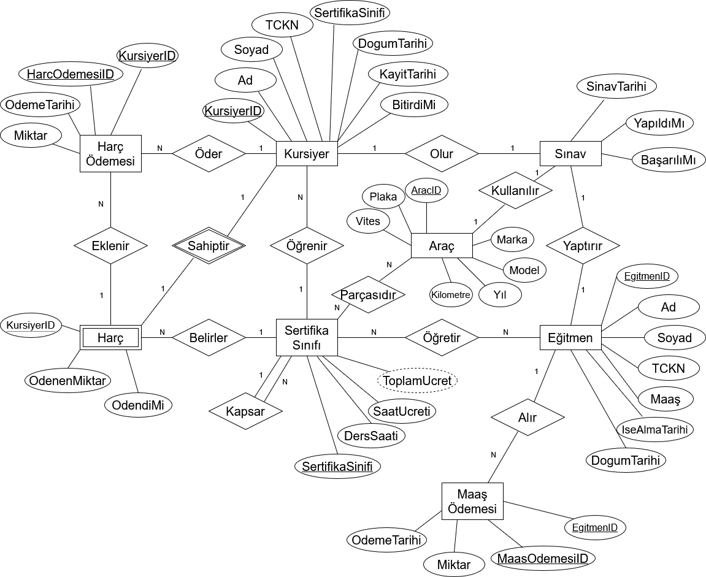
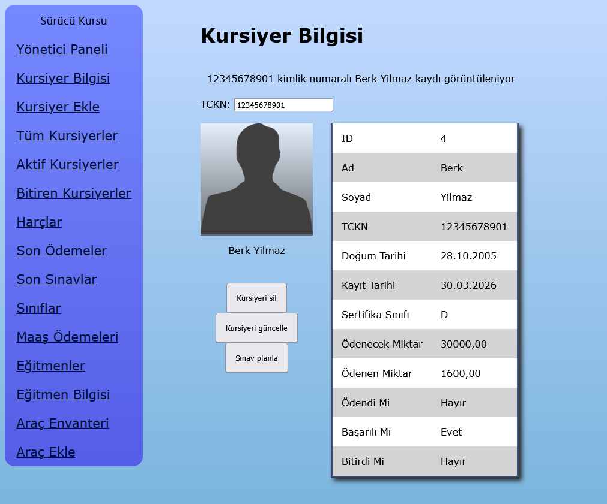
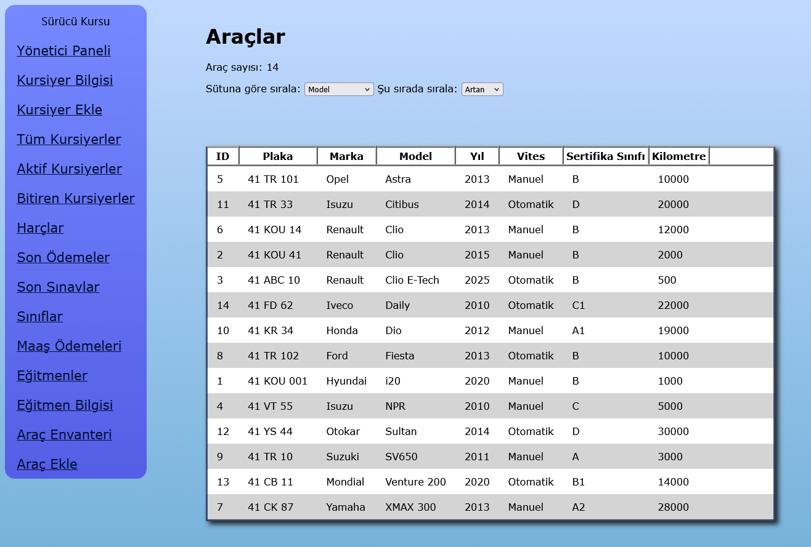
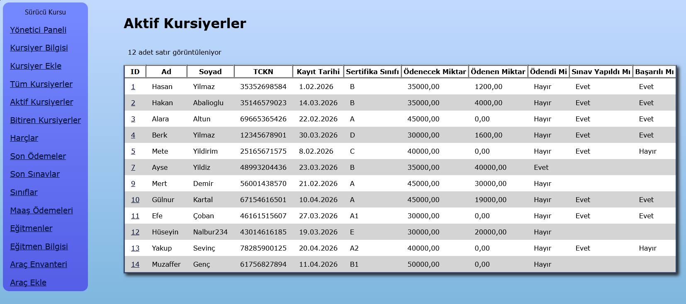

# Sürücü Kursu Veritabanı Projesi
**Kocaeli Üniversitesi Bilişim Sistemleri Mühendisliği Bölümü**<br>
**Veritabanı Yönetim Sistemleri Dersi**<br>
**2025-2026 Bahar Yarıyılı Proje Ödevi**<br>
**Grup No: 30**
>Berk Çifçi 251307112<br>
>Yekta Köktürk 251307103
## Özet
Projenin amacı, teorik olarak bir sürücü kursunun gündelik ihtiyaçlarını karşılayabilecek bir veritabanı ve verilerin görüldüğü ve düzenlendiği bir web arayüzü tasarlamaktır.

Web arayüzü ASP.NET Blazor ile geliştirilmiştir. Veritabanı SQL Server Express sürümüyle gelen LocalDB yerel veritabanı motorunu kullanır.

Geliştirme aşamasında SQL Server Management Studio (SSMS) ve Visual Studio Code yazılımları kullanılmıştır.

## ER Diyagramı


## Kurulum
### Veritabanı
---
SQL Server Express şu bağlantıdan indirilebilir:
> https://www.microsoft.com/en-us/download/details.aspx?id=104781

LocalDB yüklemek için şu yönergeler izlenebilir:
> https://learn.microsoft.com/tr-tr/sql/database-engine/configure-windows/sql-server-express-localdb?view=sql-server-ver17#install-localdb

Bu projede varsayılan isimde LocalDB kullanılacaktır. LocalDB aşağıdaki şekilde kontrol edilebilir. İlerlemeden önce `MSSQLLocalDB`'nin çalışır durumda olduğundan emin olunmalıdır.
| | |
|-|-|
|Oluştur| `SqlLocalDB.exe create MSSQLLocalDB`|
|Durum| `SqlLocalDB.exe info MSSQLLocalDB`|
|Başlat| `SqlLocalDB.exe start MSSQLLocalDB`|

Bu aşamada `30_sql_betikleri.sql` dosyası kullanılacaktır. Bu dosya bütün tablo, View, Trigger vb. yapıları barındırır. Tablolar test verileri ile kendiliğinden doldurulacaktır. Dosya SSMS üzerinde açıldıktan sonra `Alt+X` kısayolu ile yürütülebilir.

### Web Arayüzü
---
.NET SDK indirme bağlantısı:
> https://dotnet.microsoft.com/en-us/download

Entity Framework Core için gerekli paketler proje klasöründe aşağıdaki komutlarla kurulabilir.
```powershell
dotnet add package Microsoft.EntityFrameworkCore.SqlServer
dotnet add package Microsoft.EntityFrameworkCore.Design
```

Son olarak web arayüzü `dotnet run` komutuyla çalıştırılabilir. Konsolda görünen `http://localhost:5242` adresine giderek web arayüzüne erişilebilir.

## Geliştirme
Projenin veritabanındaki varlıklara erişebilmesi ve özelliklerini okuyabilmesi için model dosyalarına ihtiyaç vardır. Bu dosyalar Entity Framework (EF) aracılığıyla otomatik olarak oluşturulabilir. Aşağıdaki komut EF araçlarını yükler.
```powershell
dotnet tool install --global dotnet-ef
```
Aşağıdaki komut Scaffolding (tersine mühendislik) kullanarak `Components\Models` klasöründe `MSSQLLocalDB` veritabanında bulunan her varlık için (tablo, View vs.) bir model dosyası oluşturur.
```powershell
dotnet ef dbcontext scaffold "Data Source=(localdb)\MSSQLLocalDB;Initial Catalog=SurucuKursu" Microsoft.EntityFrameworkCore.SqlServer -o "Components\Models" --use-database-names --no-pluralize -v -f
```
Aşağıda bir model dosyası örneği verilmiştir. `HarcOdemeleri` tablosunun bütün sütunları bir üye olarak EF tarafından otomatik olarak oluşturulmuştur.
```csharp
namespace SurucuKursu.Components.Models;

public partial class HarcOdemeleri
{
    public int HarcOdemesiID { get; set; }

    public int? KursiyerID { get; set; }

    public decimal Miktar { get; set; }

    public DateTime OdemeTarihi { get; set; }

    public virtual Kursiyerler? Kursiyer { get; set; }
}
```

## Örnek Görseller




## Kaynaklar
* https://dotnet.microsoft.com/en-us/learn/aspnet/blazor-tutorial/intro
* https://learn.microsoft.com/en-us/ef/core/get-started/overview/first-app
* https://learn.microsoft.com/en-us/ef/core/managing-schemas/scaffolding/
* https://learn.microsoft.com/en-us/aspnet/core/blazor/blazor-ef-core
* https://learn.microsoft.com/en-us/aspnet/core/blazor/tutorials/build-a-blazor-app
* https://learn.microsoft.com/en-us/aspnet/core/blazor/components/data-binding
* https://learn.microsoft.com/en-us/aspnet/core/data/ef-mvc/sort-filter-page
* https://learn.microsoft.com/en-us/aspnet/core/razor-pages/razor-pages-conventions
* https://learn.microsoft.com/en-us/aspnet/core/blazor/fundamentals/navigation